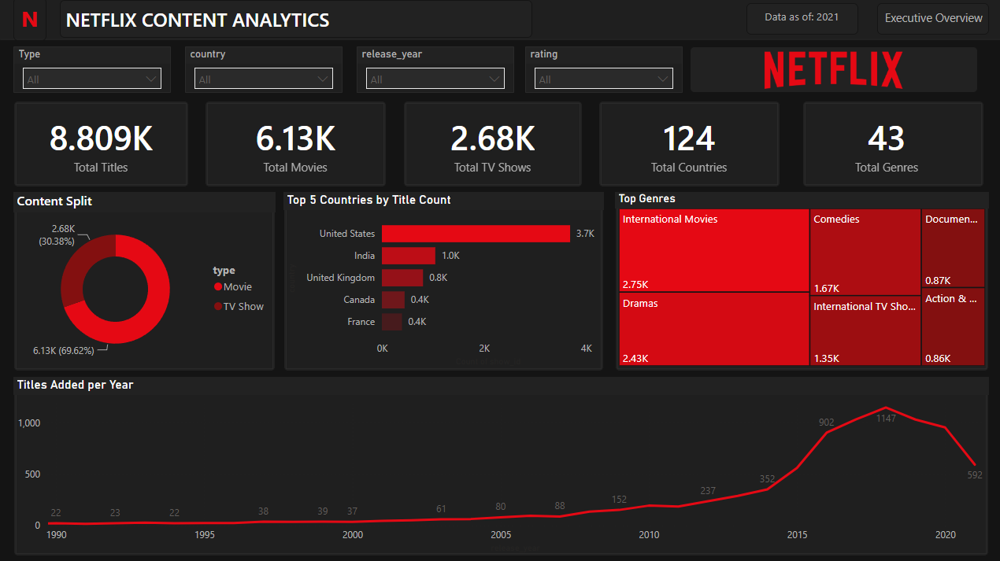

<p align="center">
  
</p>

<h1 align="center">Netflix Movies & TV Shows — Data Analysis & BI Dashboard</h1>

<p align="center">
  <em>End-to-end analytics: SQL exploration → ETL → Star Schema → Interactive Power BI Dashboard</em>
</p>

<p align="center">
  
  
  
  
</p>

---

## 🛠 Tech Stack

- **SQL Server** — Answered 15 business questions using CTEs, `CROSS APPLY STRING_SPLIT`, and `CASE WHEN`
- **Power Query** — Cleaned data, split `duration` into value/unit, expanded multi-value columns into normalized dimension tables
- **Power BI** — Built a Star Schema (Fact + 5 Dimensions with bidirectional cross-filtering)
- **DAX** — Created dynamic measures (`Total Content`, `Total Movies`, `Total TV Shows`, `Distinct Countries`, `Distinct Genres`) in a dedicated `_Measures` table

---

## 🔄 Data Workflow

```
Raw CSV  →  Power Query (ETL)  →  Star Schema  →  DAX Measures  →  Dashboard
```

**Star Schema:** `netflix_titles` (Fact) → `Dim_Cast` · `Dim_Director` · `Dim_Country` · `Dim_Genre` · `Calendar` (DAX-generated)

---

## 🎨 Dashboard — Single-Page Executive Overview

| Feature | Details |
|---|---|
| **Layout** | Single-page design — all KPIs, charts, and filters in one view |
| **Theme** | Dark mode `#141414` with Netflix Red `#E50914` accents |
| **UX** | Synced slicers, native shape containers, clean app-like feel |

<p align="center">
  
</p>

---

## 📊 Key Insights

| KPI | Value |
|---|---|
| 🎬 **Total Movies** | 6.13K |
| 📺 **Total TV Shows** | 2.68K |
| 🌍 **Total Countries** | 124 |
| 🎭 **Total Genres** | 43 |

---

<p align="center"><strong>⭐ Star this repo if you found it useful!</strong></p>
